# 功能特性与管理指南

## 配置管理

插件提供了完整的控制面板来管理数据源和行为。

### 1. 弹出菜单 (Popup)
点击浏览器工具栏的插件图标，可以查看当前状态摘要并进入完整控制面板。

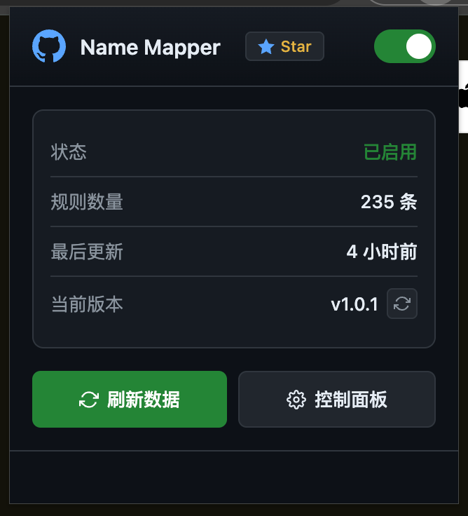

### 2. 数据源设置
在控制面板中，你可以配置多个远程 JSON 数据源。
- **多数据源**: 添加一个或多个 JSON URL，所有启用的数据源会自动合并（按 GitHub 用户名去重）。
- **启用/禁用**: 可单独开启或关闭每个数据源。
- **全部加载**: 一键从所有启用的数据源获取数据。
- **每日自动更新**: 开启后每天自动从所有启用的数据源更新数据。

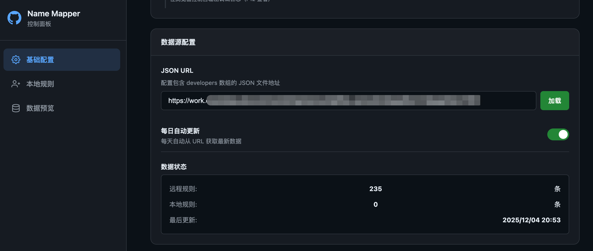

### 3. 本地规则
你可以手动添加本地映射规则，这些规则会覆盖远程数据。这对于临时修正或添加缺失用户非常有用。

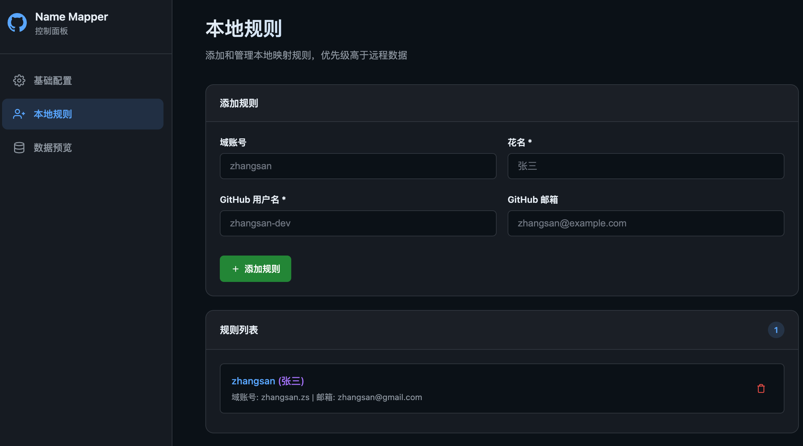

### 4. 数据预览
在可搜索的表格中查看所有已加载的映射（包含远程和本地数据）。

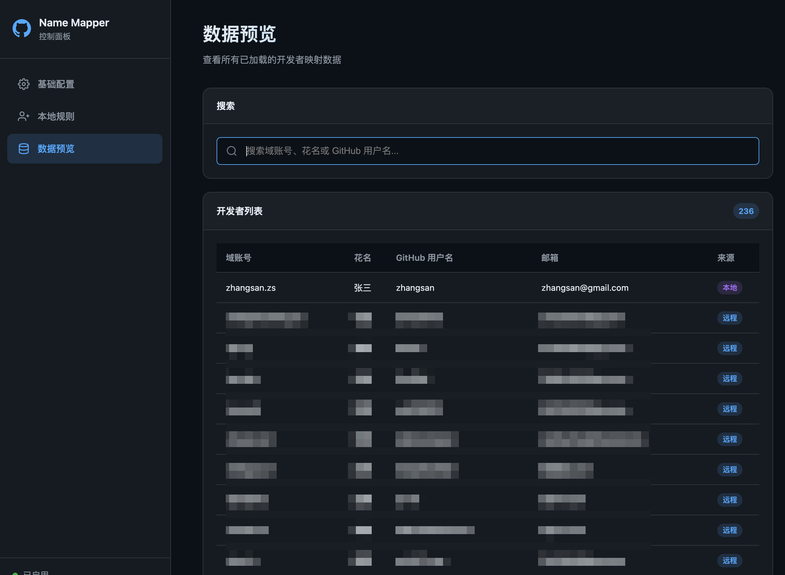

### 5. 功能开关
根据需要开启或关闭特定功能。

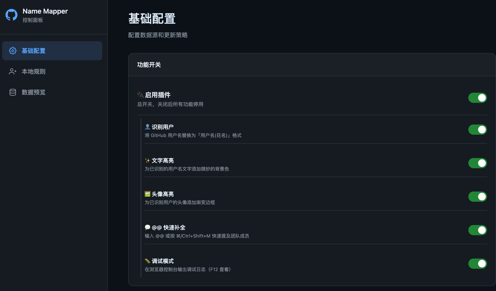

---

## 实际效果展示

插件会自动将 GitHub 页面上的用户名替换为「用户名(花名)」格式。

### 1. 提交历史 (Commits)
一眼看出是谁提交的代码。

### 2. Issue/PR 指派 (Assignments)
轻松识别被指派人。

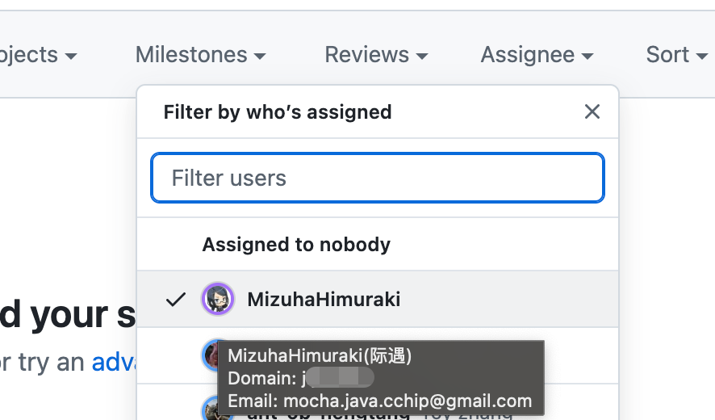

### 3. 代码评审请求 (Review Requests)
清楚知道你在邀请谁进行评审。

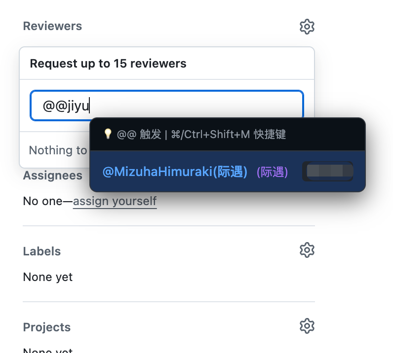
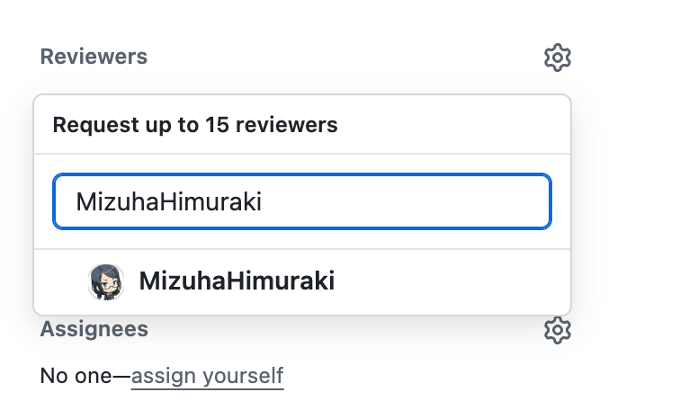

### 4. 讨论区 (Discussions)
在讨论线程中显示花名。

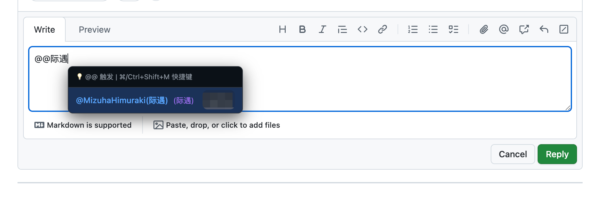

### 5. Workflow 运行记录
识别是谁触发了流水线。

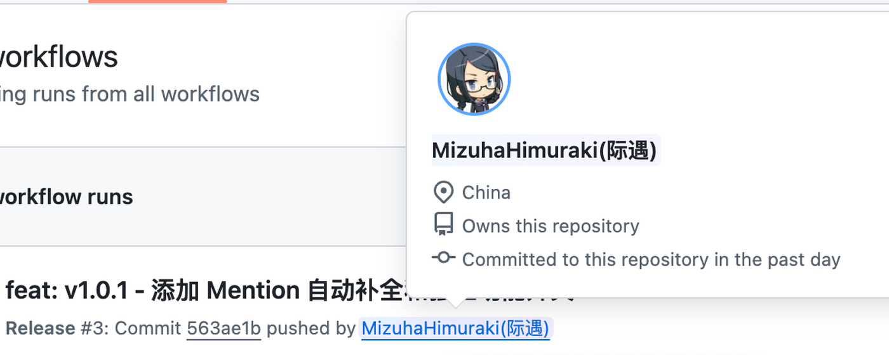

### 6. 高亮显示
(功能展示)

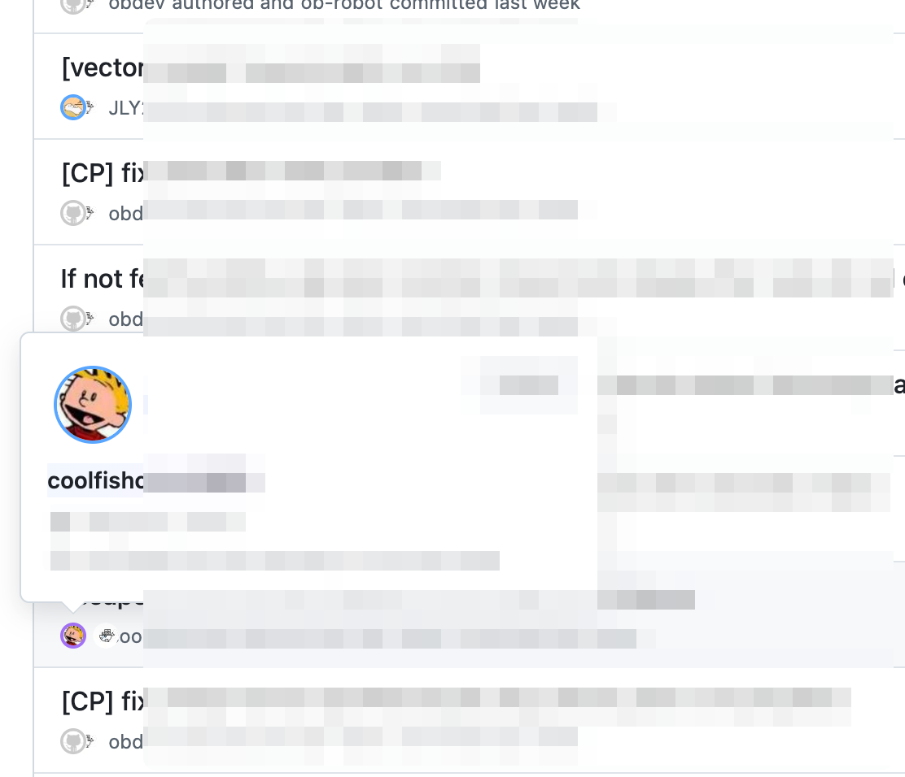

