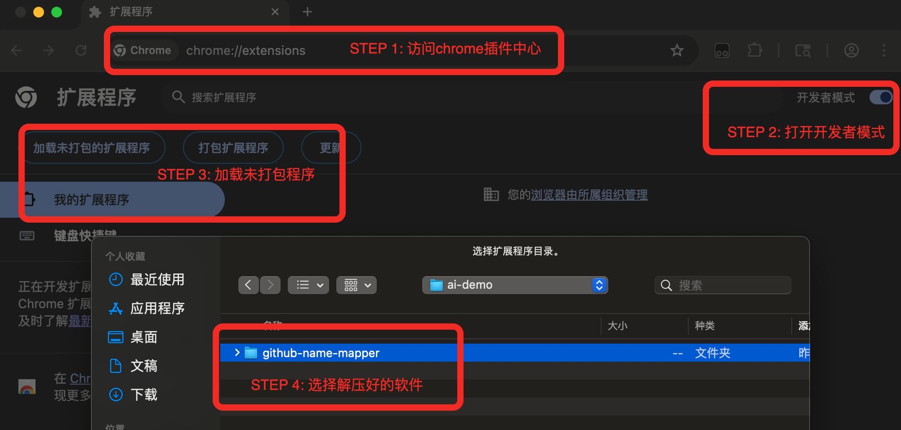
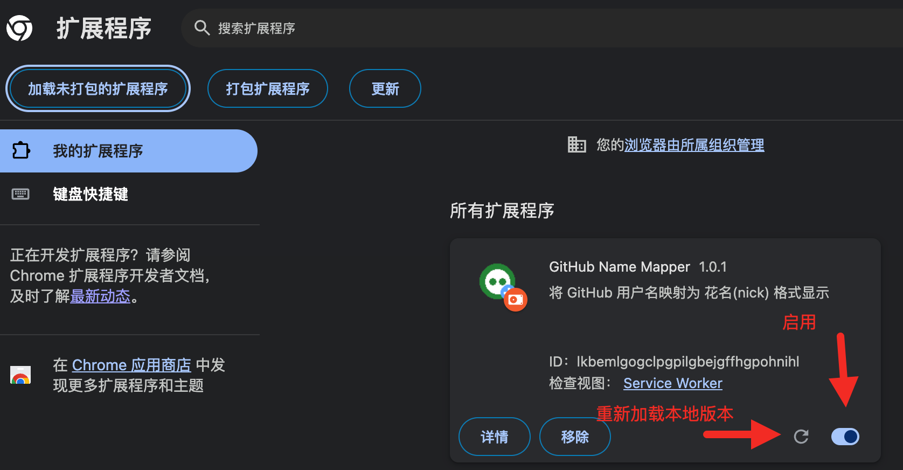

# 安装指南

## 1. 下载扩展

### 方式 A：从 Releases 下载（推荐）

1. 访问 [最新版本](https://github.com/MizuhaHimuraki/github-name-mapper/releases/latest) 页面。
2. 下载 `github-name-mapper-vX.X.X.zip` 文件。
3. 解压到本地文件夹。

### 方式 B：克隆仓库

```bash
git clone https://github.com/MizuhaHimuraki/github-name-mapper.git
```

## 2. 加载到 Chrome

1. 打开 Chrome 浏览器，访问地址栏 `chrome://extensions/`。
2. 打开右上角的 **开发者模式 (Developer mode)** 开关。
3. 点击 **加载已解压的扩展程序 (Load unpacked)** 按钮。
4. 选择你刚刚下载/解压的 `github-name-mapper` 文件夹。



## 3. 验证安装

加载完成后，你应该能在扩展列表中看到 **GitHub Name Mapper** 的卡片。

现在你可以点击浏览器工具栏中的扩展图标来访问配置页面。


